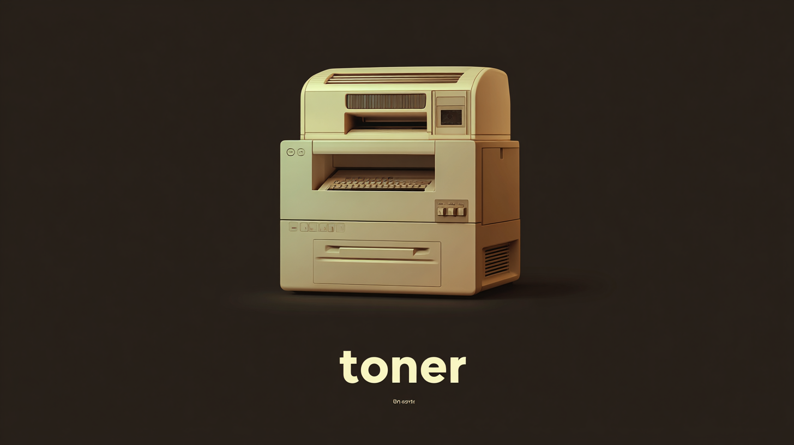
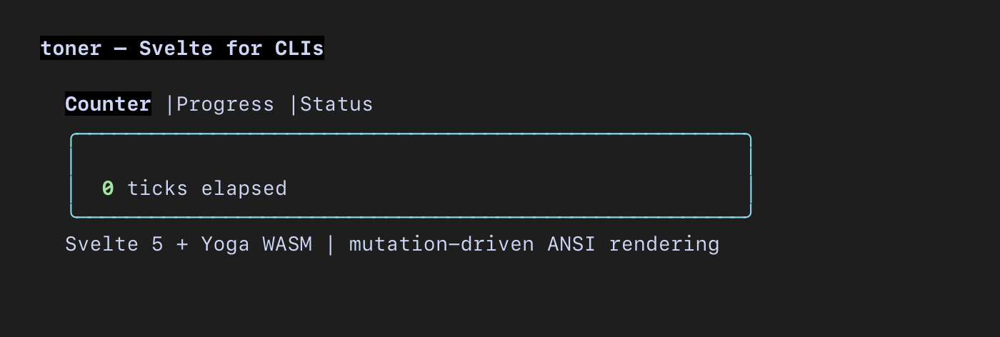
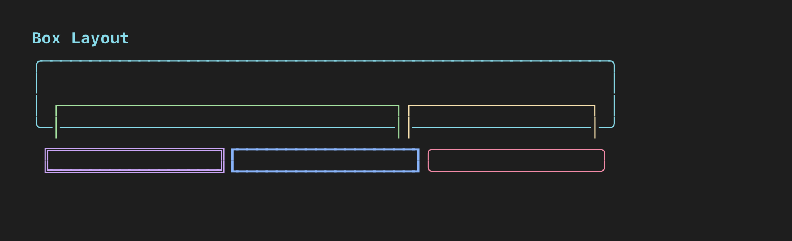
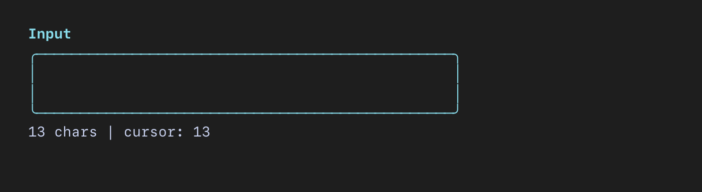
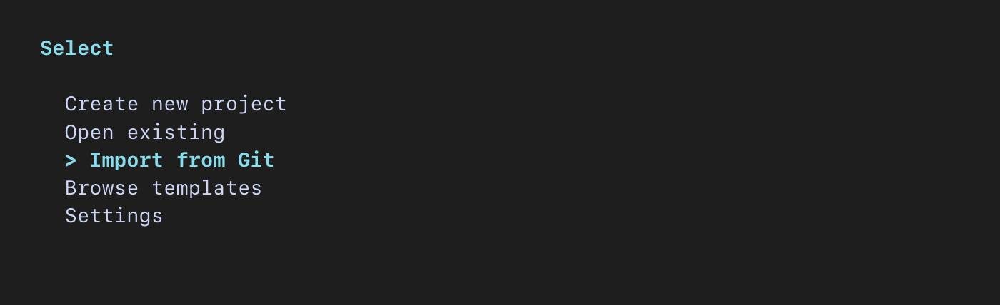
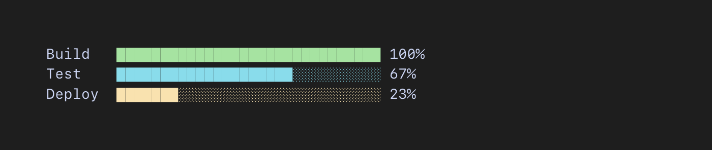
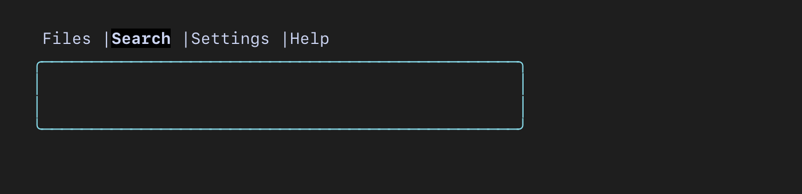
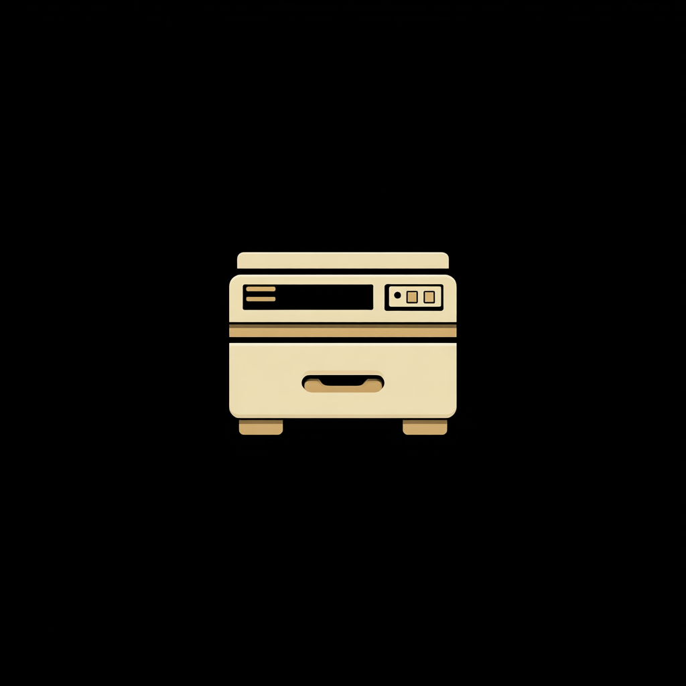

<div align="center">
  <br>
  <a href="#install"></a>
  <br><br>
  <strong>Build terminal UIs with Svelte.</strong>
  <br>
  <code>$state</code>, <code>$derived</code>, <code>$effect</code> — but the output is ANSI, not DOM.
  <br><br>
  
  <br><br>
</div>

```svelte
<script>
  import Box from 'toner/components/Box.svelte';
  import Spinner from 'toner/components/Spinner.svelte';

  let count = $state(0);
  $effect(() => { const t = setInterval(() => count++, 100); return () => clearInterval(t); });
</script>

<Box borderStyle="round" borderColor="cyan" padding={1}>
  <Spinner style="green" label="{count} tests passed" />
</Box>
```

```ts
import { render } from 'toner';
import App from './App.svelte';
render(App);
```

Two dependencies. `svelte` and `yoga-layout`. That's it.

## Install

```sh
bun add toner svelte
```

## How it works

Svelte's compiler emits DOM calls. Toner intercepts them with a lightweight proxy tree, lays it out with Yoga, and renders to ANSI.

When `$state` changes, Svelte sets `node.nodeValue` directly. Toner catches the mutation and emits ANSI for just that region — no tree walk, no diff, no reconciler.

**Keystroke-to-pixel: 3us p50, 30us p99.**

## Components

### Box



Flexbox container. All layout props map to Yoga.

```svelte
<Box flexDirection="row" gap={1} padding={1} borderStyle="round">
  <Box flexGrow={1}><span>Left</span></Box>
  <Box width={20}><span>Right</span></Box>
</Box>
```

**Props:** `flexDirection`, `flexGrow`, `flexShrink`, `justifyContent`, `alignItems`, `width`, `height`, `minWidth`, `minHeight`, `padding`, `paddingX`, `paddingY`, `margin`, `marginX`, `marginY`, `marginTop`, `gap`, `display`, `overflow`, `borderStyle` (`round` | `single` | `double` | `bold`), `borderColor`, `style`.

### Input



Text input with cursor, multiline support, and paste collapsing.

```svelte
<Input placeholder="Type here..." maxHeight={4} />
```

### Select



Scrollable selection list with keyboard navigation.

```svelte
<Select items={['Create project', 'Open existing', 'Import from Git']}
        onSelect={(item) => console.log(item)} />
```

### Spinner

Braille dots. All spinners share one global clock so they stay in phase.

```svelte
<Spinner style="yellow" label="Loading..." />
```

### ProgressBar



```svelte
<ProgressBar value={42} max={100} width={30} style="green" />
```

### Tabs



```svelte
<Tabs items={['Files', 'Search', 'Settings']} />
```

### Stream

Append-only text. Built for LLM token streaming.

```svelte
<Stream bind:text />
```

### Overlay

Padded container with optional title, for dialogs and modals.

## Styles

`data-style` attributes for ANSI styling. Combine with `;`:

```svelte
<span data-style="bold;red">Error</span>
<span data-style="#ff6600">Hex color</span>
<span data-style="bgBlue;white">Inverted</span>
```

Named colors, bright variants, backgrounds, hex, `rgb()`, `ansi256()`, and modifiers (`bold`, `dim`, `italic`, `underline`, `inverse`, `strikethrough`).

## Render API

```ts
import { render } from 'toner';

const app = render(MyComponent, { someProp: 'value' });

app.component;        // Svelte instance
app.target;           // Root TuiElement
app.renderToString(); // ANSI string (80x24)
app.layout(80, 24);   // Cached Yoga layout renderer
app.unmount();
```

## Input handling

```ts
import { parseKeys, enterRawMode, exitRawMode } from 'toner';

enterRawMode();
const events = parseKeys(stdinBytes);
// { type: 'char', char: 'a' }, { type: 'enter' }, { type: 'ctrl_c' }
exitRawMode();
```

## Focus

Stack-based keystroke dispatch.

```ts
import { registerFocusable, focus, pushFocus, popFocus } from 'toner';

registerFocusable('input', handler);
registerFocusable('modal', handler);

focus('input');       // input gets keystrokes
pushFocus('modal');   // modal on top
popFocus();           // back to input
```

## Render loop

Event-driven. Zero CPU when idle. Synchronized output (DEC 2026) prevents tearing.

```ts
import { createRenderLoop } from 'toner';

const loop = createRenderLoop(root, cols, rows, (frame) => process.stdout.write(frame));
loop.start();
loop.resize(newCols, newRows);
loop.stop();
```

## Benchmarks

```
Keystroke p50    3–10us
Keystroke p99    25–50us
Full render      ~310us
Cached render    ~43us
```

119 tests. Every commit must pass p99 < 5ms.

## Development

```sh
bun install
bun test
bun run dev             # interactive demo
bun run bench           # keystroke latency
bun run check           # lint + format + test
```

<div align="center">
  <br>
  
  <br><br>
</div>

## License

MIT
